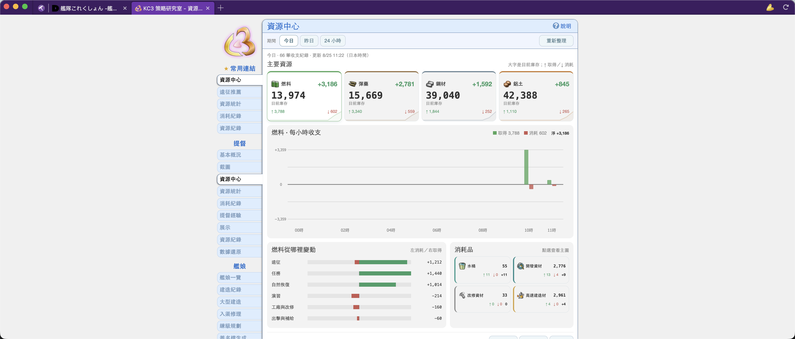
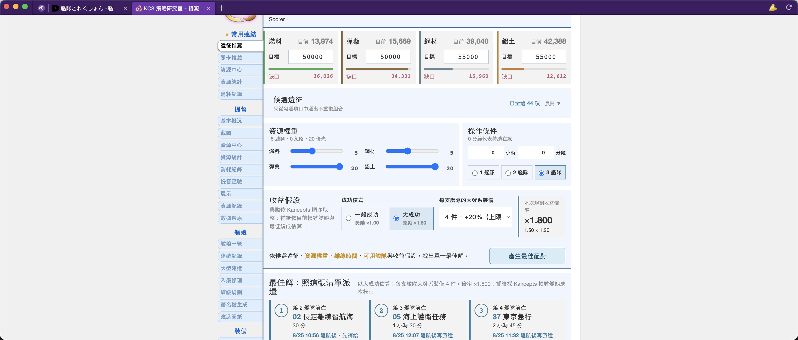
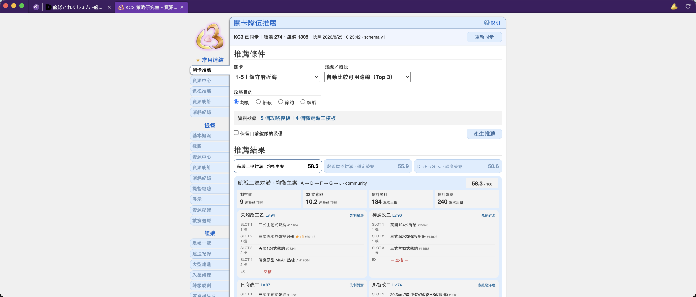

#  kancolle-assistant

**English** · [繁體中文](./README.zh-TW.md) · [简体中文](./README.zh-CN.md) ·
[日本語](./README.ja.md)

KanColle Assistant is a minimal, tabbed web browser for playing Kantai Collection, with integrated
KC3Kai and KCCacheProxy support.

This project is a modified fork of [planetarian/damecon-browser](https://github.com/planetarian/damecon-browser).<br>
The original Damecon project is built on Samuel Maddock's [electron-browser-shell](https://github.com/samuelmaddock/electron-browser-shell).

## Release status

| App version | README updated |
| ----------- | -------------- |
| `v1.0.28`   | `2026-09-29`   |

- **Downloads:** Installers and portable archives are available from
  [GitHub Releases](https://github.com/kevinsuu/kancolle-assistant/releases).
- **Per-version changes:** The
  [latest release notes](https://github.com/kevinsuu/kancolle-assistant/releases/latest) contain the
  generated update log between tags.
- **Cumulative capabilities:** [Feature status](#feature-status) shows what the current source
  supports, what may be added later, and what is out of scope.
- **Technical details:** The project-specific highlights below link to the relevant documents.

### v1.0.28 highlights (since v1.0.27)

- Master Ship remodel tooltips now supplement incomplete KC3Kai data for Kitakami Kai San, including Arsenal Resources, Development Materials, and Torches with their required quantities.

### v1.0.27 highlights (since v1.0.26)

- [Quest Recommendations](./docs/quest-recommendations.md) recovers from a failed manual sync by reading KC3's local data once, so usable quests appear without switching pages.
- Existing results remain available if recovery fails, with distinct sync, ranking, and data-load messages; fallback data is clearly marked as unconfirmed.

### v1.0.26 highlights (since v1.0.25)

- [Quest synchronization](./docs/quest-recommendations.md) now handles malformed server responses as retryable failures instead of uncaught main-process exceptions.
- Quest ranking runs in a separate background worker with a 30-second limit, preventing stalled ranking from blocking the main process and allowing retry.

### v1.0.25 highlights (since v1.0.24)

- The 5-4 guide now includes a fast battleship and carrier upper-route fleet with interchangeable fast battleships.
- All 5-4 routes treat air power as a recommended target while retaining required routing LoS; the fast battleship night route now shows its D-node maelstrom correctly.

### v1.0.24 highlights (since v1.0.23)

- Quest Recommendations lists each quest once by default; select **Combined** to see complete shared-action plans.
- The standard 6-1 carrier and submarine fleet now requires 126 air power for superiority at the boss node.

### Project-specific highlights

Compared with the original project, this source adds or improves:

1. **[Account access](./docs/dmm-local-login-storage.md)** — With confirmation, DMM credentials can be encrypted by the operating system's secure storage. An all-traffic mode for a trusted external forward proxy and clearer regional-error guidance are also included.
2. **[Adaptive game display](./docs/display-auto-fit.md)** — On startup, KC3 is fitted to its rendered content and the remaining display area determines the window and game-canvas scale; later resizing keeps the full game visible when possible without locking the window aspect ratio.
3. **[Normal-map fleet recommendations](./docs/fleet-recommender.md)** — In KC3 Strategy Room, select a sourced guide template for maps 1-1 through 7-5, including 5-6, and generate up to three account-owned fleets on demand without changing game state.
4. **[Ship recommendations](./docs/ship-recommendations.md)** — The Strategy Room **Ship Recommendations** page filters the NGA guide's 1–10 priority table to owned ship families that have not reached a listed guide remodel, uses canonical KC3 master data so language changes cannot alter matches, and shows each ship in a full-width row with its image, source strengths, priority rationale, and practical roles without changing game state.
5. **[Quest recommendations](./docs/quest-recommendations.md)** — The Strategy Room **任務推薦** page shows official Japanese quest titles, can manually synchronize current game status, filters individual quests by the fleet, sortie, exercise, expedition, arsenal, modernization, or other categories, and lists each quest once by default, showing complete shared-action groups when **Combined** is selected. It filters sortie quests with Chapters 1–7 enabled by default and ranks all open repeatable, normal one-time, and currently available time-limited quests using current and downstream rewards. Reward filters include a dedicated **Flight Deck Catapult** option. Time-limited quests appear under **Other** and are marked when KC3 does not provide their final deadline. Objective rules automatically derive compatible exercise and normal-map sortie stacks of up to five accepted quests; verified expedition and arsenal combinations remain supported, and non-sortie quests stay at the top regardless of chapter filters. Filter and sort settings are retained locally across page and game restarts. The visible quest list, complete conditions, and planning details can be exported as Markdown.
6. **[Expedition recommendations](./docs/expedition-resource-planner.md)** — The independent Strategy Room **遠征推薦** page shows current resources and uses adjustable resource and bucket weights, selected expeditions, success and Daihatsu settings, and fleets 2–4 to recommend one best pairing. Planning settings are retained locally across page and game restarts; the original Expedition Scorer remains unchanged and expeditions are never dispatched automatically.
7. **[Resource Center and ledger summary](./docs/resource-ledger-summary.md)** — The new KC3 Strategy Room **資源中心** dashboard shows current resources, gains, consumption, net change, hourly activity, source breakdowns, and consumables for today, yesterday, or the last 24 hours.
8. **[KC3 DevTools integration](./docs/kc3-devtools.md)** — The KC3 `KanColle` panel is moved forward and selected when game DevTools opens, reducing repeated manual navigation.
9. **[Strategy Room pinned links](./docs/strategy-room-recent-tabs.md)** — Pin any available Strategy Room tabs in `常用連結` with no fixed count limit; new pins appear first, existing links are retained, and ordinary navigation keeps their order unchanged.
10. **[Daily improvement filters](./docs/daily-improvement-filter.md)** — KC3's Daily Improvements page applies KC3's own improvable-equipment filter once by default and adds a horizontal filter containing only the equipment types currently available for improvement, while leaving the native toggle available for the complete list.
11. **[Master Ship remodel materials](./docs/master-ship-remodel-materials.md)** — Master Ship remodel tooltips list every special material with its icon, localized name, and required quantity.

These added Strategy Room interfaces follow KC3's selected language and support English,
Traditional Chinese, Simplified Chinese, and Japanese.

## ⚠️ Notice

#### KanColle Assistant is NOT intended to be used as a general-purpose browser.

KanColle Assistant is designed for one purpose only: playing KanColle.

KanColle Assistant is built upon Electron and lacks many security features found in major
browsers.

Seriously, I've literally never worked with Electron before. There's some real spaghetti-tier code going on here. Do you really wanna put your trust in that?

#### If you use KanColle Assistant for sensitive activities, you do so at your own risk.

## Usage

### From a Release build:

From the [Releases page](https://github.com/kevinsuu/kancolle-assistant/releases/latest), download
one of the following:

Installer: `kancolle-assistant-*.Setup.exe`

- Simply download and run it to install.
- This provides automatic updates for KanColle Assistant and is the simplest installation method.

Alternatively, use the ZIP file: `kancolle-assistant-*.zip`

- Download and extract its contents to an empty folder, then run `kancolle-assistant.exe`.
- This lets you use specific versions if desired, but lacks automatic updates.

### From source code, using `yarn`:

```bash
# Get the code
git clone --recurse-submodules https://github.com/kevinsuu/kancolle-assistant
cd kancolle-assistant

# Install and launch the browser
yarn
yarn start
```

### 🔌 Install extensions

Unpacked extensions inside `./extensions` will be loaded automatically.

- Supports both Manifest V2 and V3 extensions.
- Some/many plugins may not run properly (or at all) due to various extension APIs being unsupported.

There are a few plugins bundled with the Release builds for your convenience. It is safe to remove them if you wish (just delete from the `extensions` folder).

### ⚙️ Configure settings

On first launch, the settings page will open.

It will automatically begin downloading the latest Release version of KC3Kai, and upon completion, the KC3 start page will open.

You can access the KanColle Assistant settings at any time by clicking the app icon at the
top-left corner of the window.

### KC3Kai Update Configuration

The KC3Kai section in the settings page allows you to configure how KC3 is updated.

You can select from three different update channels: `release`, `master`, and `develop`.

- It is recommended to remain on the `release` channel, for the most stable experience.
- `master` and `develop` contain code actively in development, and may be unstable.
  - If using one of these two channels, the initial update may take several minutes to complete.
- Different channels are stored independently and have their own separate profiles.
  - You can switch between channels at any time, and those channels won't need to be re-downloaded.
  - Switching channels will automatically unload the old channel's extension and load the new one in.
  - To remove the files for a channel, simply delete the associated `kc3kai-*` folder within `./extensions`.

### Proxy Configuration

KanColle Assistant integrates with KCCacheProxy, so extensions such as ProxySwitchy are no longer
necessary.

You can configure your KCCP host/port in the `Proxy` section of the settings page.

The `Enabled` checkbox will enable/disable routing KanColle traffic through the proxy.

`KCCP internal` and `KCCP external` only proxy KanColle game-server traffic. They do not change
the public IP used for DMM login and region checks. To use an authorized HTTP/HTTPS forward proxy
for all browser traffic, select `all-external`, enter its host and forward-proxy port, and then
enable proxying. KanColle Assistant reapplies the proxy, closes pooled connections, and retries a DMM page
that was redirected to the regional-access error.

KanColle Assistant does not include or discover public proxies. Do not send DMM credentials through an
untrusted proxy. If DMM displays its regional-access page while you are already on a supported
network, disable unintended VPN, proxy, or private-relay software and retry.

## Feature status

### ✨ Showcase

Resource Center summarizes current resources and recent gains, consumption, and net changes:



Expedition Recommendations shows current resources and assigns the best expedition to each
available fleet:



Map Recommendations suggests account-owned fleets and equipment for normal maps:



### 🚀 Current

- [x] [Shared account snapshots across Strategy Room windows, with isolated background workers for fleet, expedition, and resource calculations](./docs/shell-runtime-architecture.md)
- [x] Installer + Application auto-update on startup, game open, and every six hours
- [x] KC3Kai integration
- [x] Automatic updates for KC3
- [x] Support both release and in-development versions of KC3
- [x] Configurable KC3 update schedule (daily/weekly/always/never)
- [x] Auto-open KC3 start page (with developer tools) and strategy room
- [x] Prioritize and select the KC3 `KanColle` panel when game DevTools opens
- [x] KCCacheProxy full integration & proxy client support
- [x] Authorized all-traffic external proxy mode with DMM regional-error guidance
- [x] [Preset and custom browser colors, light/dark themes, and an uploadable settings icon](./docs/theme-personalization.md)
- [x] Manifest V3 extensions support
- [x] Chrome Webstore extensions support
- [x] New Tab page with links to common third-party KanColle resources
- [x] Configuration options for new tab behavior
  - Can select KC3 launch page, DMM game page, strategy room
- [x] Multiple window support
- [x] 'Custom' channel for managing your own KC3 folder location
- [x] Common keyboard shortcuts (F12, Ctrl+T, Ctrl+F4, Ctrl+Tab, Ctrl+D, etc)
- [x] Per-site address bar hiding with wildcard support
- [x] Common mouse gestures (Tab middle-click, draggable tabs, Ctrl+scroll, etc)
- [x] Find in page (Ctrl+F)
- [x] DMM-only local credential vault using operating-system encryption
- [x] Responsive KanColle game-canvas auto-fit with a freely resizable window
- [x] Account-aware normal-map fleet recommendations for maps 1-1 through 7-5, using linked
      guide-verified fleet skeletons, requiring Strategy Room to choose a linked guide template
      instead of a blank automatic route, with validated
      flexible carrier air control, ASW duty allocation, combat-loadout variants and partial regular
      slots when equipment is scarce, a 2-1 carrier fallback and instant-construction-material route,
      current KC3 water-fighter/aircraft/ordnance categories, 2-5/5-5 drum routing, Fast+
      equipment, expansion-slot assignments, night-carrier setups, source-matched 3-5 upper,
      submarine, Nelson Touch, fixed-lower, and random-lower fleets, plus 4-4 fleet-wide flexible
      air control and Ise/Hyuga Kai Ni Zuiun cut-ins, and 4-5 Fast+ night-carrier, CVL small-ship,
      Nelson Touch, and detour configurations with air-power-first
      flexible carrier aircraft allocation for mixed anti-installation assignments, plus automatic 5-5
      special-attack pairing, fleet order, and
      formation guidance; same-fleet loadout variants reach KC3 complete-loadout bonus and target-specific power reranking before fleet deduplication
- [x] Account-owned ship-family training priorities from the supplied NGA 1–10 guide table, matched
      with canonical KC3 master data; families at a listed guide remodel are omitted, and full-width
      rows show localized ship names, images, source strengths, priority rationale, and practical roles
- [x] Official Japanese quest titles, manual latest-status sync, multi-select quest-type filters
      with a Combined category that retains complete shared-action groups,
      default-on Chapter 1–7 sortie filters, verified shared-action plans for sorties, exercises,
      expeditions, and arsenal work, and non-sortie quests kept above every open repeatable and
      normal one-time sortie quest; currently available time-limited quests appear under Other
      with an unknown-final-deadline notice, and filter and sort settings persist locally across
      page and game restarts
- [x] Markdown export of the visible quest list, filters, completion conditions, rewards, deadlines,
      locked successors, and suggested-combination workflows
- [x] Weighted expedition recommendations with fleet assignments
- [x] KC3 resource-ledger summaries for fixed recent periods
- [x] Pinned KC3 Strategy Room quick links with no fixed count limit and stable ordering
- [x] KC3 Daily Improvements opens with the improvable-equipment filter enabled and offers a
      filter containing only currently improvable equipment types
- [x] Master Ship remodel requirements display every special material's icon, localized name, and quantity

### 🤞 Eventually

- [ ] Option to ask before installing KC3 updates
- [ ] Link hover URL tooltips
- [ ] Extension management (enable/disable/uninstall)
- [ ] .CRX extension loader
- [ ] Support for more common [`chrome.*` extension APIs](https://developer.chrome.com/extensions/devguide)
- [ ] Respect extension manifest permissions
  - I must reiterate, this is _not_ a secure browser

### ❌ Not planned

- Detachable tabs
- Advanced general-use browser features from Chrome/Edge/etc
  - Including a general-purpose password manager and other security features
- AI integration of any kind (you're welcome)

## License

GPL-3

This repository is a modified fork of the original [damecon-browser](https://github.com/planetarian/damecon-browser) project maintained by planetarian.<br>
Damecon itself is based on Samuel Maddock's [electron-browser-shell](https://github.com/samuelmaddock/electron-browser-shell) project.

The following notice has been retained from the original repository:

> For proprietary use [of electron-browser-shell], please [contact [samuelmaddock]](mailto:sam@samuelmaddock.com?subject=electron-browser-shell%20license) or [sponsor [samuelmaddock] on GitHub](https://github.com/sponsors/samuelmaddock/) under the appropriate tier to [acquire a proprietary-use license](https://github.com/samuelmaddock/electron-browser-shell/blob/master/LICENSE-PATRON.md). These contributions help make development and maintenance of this project more sustainable and show appreciation for the work thus far.

### Contributor license agreement

By sending a pull request, you hereby grant to owners and users of the
electron-browser-shell project a perpetual, worldwide, non-exclusive,
no-charge, royalty-free, irrevocable copyright license to reproduce, prepare
derivative works of, publicly display, publicly perform, sublicense, and
distribute your contributions and such derivative works.

The owners of the damecon-browser/electron-browser-shell projects will also be granted the right to relicense the
contributed source code and its derivative works.
