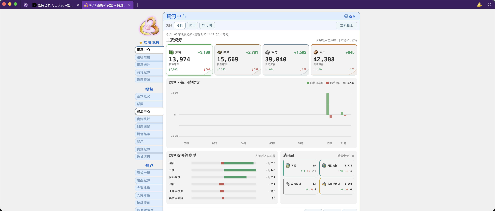
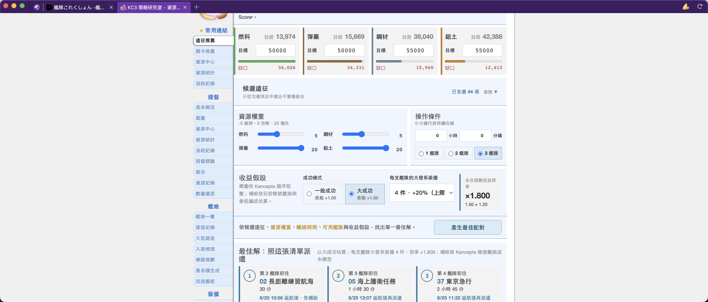
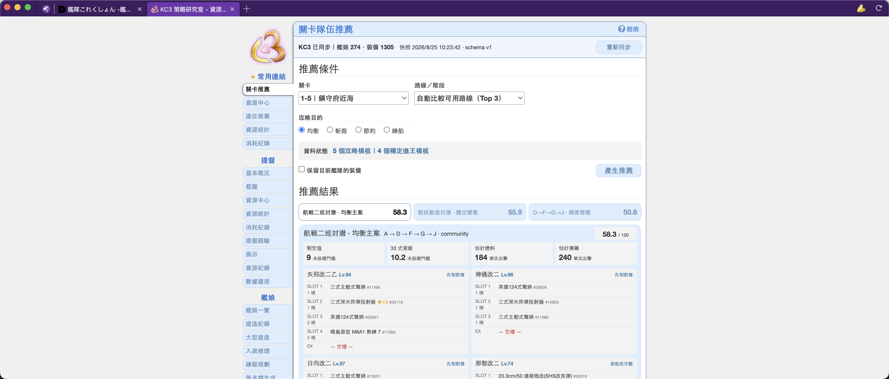

#  kancolle-assistant

[English](./README.md) · [繁體中文](./README.zh-TW.md) · **简体中文** ·
[日本語](./README.ja.md)

KanColle Assistant 是一款专为游玩《舰队 Collection》设计的精简标签页式浏览器，集成
KC3Kai 与 KCCacheProxy 支持。

本项目是原作者 planetarian 的 [damecon-browser](https://github.com/planetarian/damecon-browser) 修改分支。<br>
Damecon 原项目基于 Samuel Maddock 的 [electron-browser-shell](https://github.com/samuelmaddock/electron-browser-shell)。

## 版本状态

| 应用程序版本 | README 更新日期 |
| ------------ | --------------- |
| `v1.0.4`     | `2026-08-26`    |

- **下载版本：** 安装程序和便携式压缩包可从
  [GitHub Releases](https://github.com/kevinsuu/kancolle-assistant/releases)下载。
- **单一版本的变更：** [最新版本更新日志](https://github.com/kevinsuu/kancolle-assistant/releases/latest)
  会保存每个 tag 之间自动生成的更新内容。
- **当前累积能力：** [功能状态](#功能状态)分别列出当前支持、将来可能加入和不在计划内的项目。
- **功能技术细节：** 下方项目功能重点会链接至对应文档。

### v1.0.4 更新重点（相比 v1.0.3）

- 4-5 自动推荐现在会为兼容舰娘保留三件不重复的账号持有三式弹系装备；若无法成立，也会显示明确原因。
- KC3 每日改修页面现在默认启用原生的可改修装备筛选；用户仍可切回完整列表。

### v1.0.3 更新重点（相比 v1.0.2）

- 普通海域舰队推荐改用攻略验证编成骨架，自动选择仅采用固定进王路线，并验证先制反潜门槛及填入兼容的补强增设装备。
- 远征推荐可调整资源与水桶权重，规划前会重新同步 KC3 资源、按收取间隔计算，并区分当前执行中的任务与下一次派遣建议。
- Shell runtime 会缓存设置读取、批量保存窗口尺寸、安全管理标签页视图，并隔离 KCCacheProxy 与扩展 host 的生命周期。
- 打开游戏时也会检查应用程序更新；DevTools 分割布局处理与各平台打包图标也更加稳定。

### v1.0.2 更新重点（相比 v1.0.1）

- Release tag 不再重复启动普通 CI；推荐核心测试改用明确的跨平台路径，使 Windows release
  验证能够找到所有测试文件。

### v1.0.1 更新重点（相比 v1.0.0）

- 拉伸窗口时会重新调整游戏画布，且不会锁定窗口宽高比。
- 舰队推荐会验证账号拥有的高速＋与夜战航母配置、按提速后的战力排序，并为雷巡生成合理配置。
- 推荐生成与战略室导航会复用账号及装备索引、取得足够合法方案后提前停止，并避免重复扫描整页。
- 普通海域与远征判定更新包括 EO 路线、低速舰队带路、巡洋舰水战配置及水桶收益优先级。

### 本项目功能重点

与原版相比，当前源代码新增或优化了以下功能：

1. **[账户访问优化](./docs/dmm-local-login-storage.md)** — 经用户确认后，可通过操作系统安全存储机制加密保存 DMM 登录信息；同时提供可信外部转发代理的全流量模式和地区错误提示。
2. **[自适应游戏画面](./docs/display-auto-fit.md)** — 游戏启动时根据 KC3 实际内容调整面板宽度，再以屏幕剩余空间自动调整窗口和舰娘画布；之后拉伸窗口时会尽可能完整显示游戏，且不锁定窗口宽高比。
3. **[普通海域舰队推荐](./docs/fleet-recommender.md)** — 在 KC3 战略室根据当前账号拥有的舰娘和装备，为 1-1 至 7-5（含 5-6）提供最多三套建议；不会自动更改游戏状态。
4. **[远征推荐](./docs/expedition-resource-planner.md)** — 战略室中独立的**远征推荐**页面会显示当前资源，并根据可调整的四项资源与水桶权重、已勾选远征、成功与大发设置及第 2～4 舰队状态，推荐一套最佳配对；不会修改原有远征评分页面，也不会自动派遣。
5. **[资源中心与收支摘要](./docs/resource-ledger-summary.md)** — 新增 KC3 战略室**资源中心**仪表板，可按今天、昨天或最近 24 小时查看当前资源、获取、消耗、净变化、每小时收支、来源分类与消耗品。
6. **[KC3 开发者工具集成](./docs/kc3-devtools.md)** — 打开游戏开发者工具时，优先排列并选中 KC3 的 `KanColle` 面板，减少重复手动切换。
7. **[战略室置顶链接](./docs/strategy-room-recent-tabs.md)** — 最多可将五个战略室标签页置顶到 `常用链接`；普通导航不会改变顺序，第六个置顶项会替换最下方链接。
8. **[每日改修筛选](./docs/daily-improvement-filter.md)** — KC3 每日改修页面默认应用一次 KC3 原生的可改修装备筛选，并保留切换按钮供用户查看完整列表。

这些新增的战略室界面会跟随 KC3 选择的语言，支持英文、繁体中文、简体中文和日文。

## ⚠️ 注意事项

#### KanColle Assistant 不适合作为通用浏览器。

KanColle Assistant 只为一个目的而设计：游玩《舰队 Collection》。

KanColle Assistant 基于 Electron，缺少主流浏览器所具备的许多安全功能。本项目仍可能
存在尚未发现的问题与技术限制。

#### 如果使用 KanColle Assistant 处理任何敏感信息，风险须由用户自行承担。

## 使用方式

### 使用 Release 版本

前往 [Releases 页面](https://github.com/kevinsuu/kancolle-assistant/releases/latest)，下载以下
其中一种文件：

安装程序：`kancolle-assistant-*.Setup.exe`

- 下载后直接运行即可安装。
- 安装版支持 KanColle Assistant 自动更新，也是最简单的使用方式。

或下载压缩包：`kancolle-assistant-*.zip`

- 将文件解压到空文件夹，再运行其中的 `kancolle-assistant.exe`。
- 可以保留指定版本，但不支持自动更新。

### 使用 `yarn` 从源代码启动

```bash
# 获取源代码
git clone --recurse-submodules https://github.com/kevinsuu/kancolle-assistant
cd kancolle-assistant

# 安装并启动浏览器
yarn
yarn start
```

### 🔌 安装扩展程序

放在 `./extensions` 中的未打包扩展程序会自动加载。

- 同时支持 Manifest V2 和 V3 扩展程序。
- 由于部分扩展 API 尚未支持，一些插件可能无法完整运行或完全无法执行。

Release 版本会预装几个常用插件。如果不需要，可以直接删除 `extensions` 文件夹中对应的插件。

### ⚙️ 设置

首次启动时会自动打开设置页面。

KanColle Assistant 会开始下载最新版 KC3Kai；完成后会打开 KC3 起始页面。

随时可以点击窗口左上角的应用程序图标，重新进入 KanColle Assistant 设置页面。

### KC3Kai 更新设置

设置页面中的 KC3Kai 部分可以选择 KC3 的更新方式。

共有三个更新频道：`release`、`master` 和 `develop`。

- 推荐使用最稳定的 `release` 频道。
- `master` 和 `develop` 包含开发中的代码，可能不稳定。
  - 首次使用这两个频道时，下载可能需要数分钟。
- 不同频道会分别存储，并使用各自独立的配置文件。
  - 可以随时切换频道，已经下载的频道不需要重新下载。
  - 切换时会自动卸载旧频道的扩展程序并加载新频道。
  - 如需删除某个频道，删除 `./extensions` 中对应的 `kc3kai-*` 文件夹即可。

### 代理设置

KanColle Assistant 已完整集成 KCCacheProxy，不再需要 ProxySwitchy 等扩展程序。

可以在设置页面的 `Proxy` 部分设置 KCCP 主机和端口。

勾选 `Enabled` 后，舰これ流量会按照所选模式转发到代理；取消勾选则会停用。

`KCCP internal` 和 `KCCP external` 只代理舰これ游戏服务器流量，不会改变 DMM 登录与地区检查所看到的公网 IP。如果要使用经过授权的 HTTP/HTTPS 外部转发代理处理所有浏览器流量，请选择 `all-external`，输入主机与转发代理端口后启用。KanColle Assistant 会重新应用代理、关闭已有连接，并重试被重定向到 DMM 地区限制错误页面的标签页。

KanColle Assistant 不会内置或搜索公共代理。请勿通过不受信任的代理传输 DMM 登录信息。如果当前网络地区本应受支持但仍出现地区限制页面，请关闭意外启用的 VPN、代理或 Private Relay 后重试。

## 功能状态

### ✨ 界面展示

资源中心可汇总当前资源与近期获取、消耗及净变化：



远征推荐会显示当前资源，并为可用舰队安排最佳远征：



关卡推荐会按照账号持有的舰娘与装备，提供普通海域编成建议：



### 🚀 当前功能

- [x] 安装程序与应用程序在启动、打开游戏及每六小时自动检查更新
- [x] KC3Kai 集成
- [x] KC3 自动更新
- [x] 同时支持稳定版和开发版 KC3
- [x] 可配置 KC3 更新计划（每天／每周／总是／从不）
- [x] 自动打开 KC3 起始页面、开发者工具与战略室
- [x] 打开游戏开发者工具时优先排列并选择 KC3 `KanColle` 面板
- [x] 完整集成 KCCacheProxy 与代理客户端
- [x] 经授权的外部代理全流量模式与 DMM 地区错误提示
- [x] [预设与自定义浏览器色彩、浅色／深色主题，以及可上传替换的设置页图标](./docs/theme-personalization.md)
- [x] Manifest V3 扩展程序支持
- [x] Chrome 应用商店扩展程序支持
- [x] 新标签页提供常用第三方舰これ资源链接
- [x] 可配置新标签页行为
  - 可选择 KC3 启动页面、DMM 游戏页面或战略室
- [x] 多窗口支持
- [x] 使用 `Custom` 频道管理自定义 KC3 文件夹
- [x] 常用键盘快捷键（F12、Ctrl+T、Ctrl+F4、Ctrl+Tab、Ctrl+D 等）
- [x] 按网站隐藏地址栏并支持通配符
- [x] 常用鼠标操作（中键关闭标签页、拖动标签页、Ctrl+滚轮等）
- [x] 页面查找（Ctrl+F）
- [x] 使用操作系统加密的 DMM 专用本地登录信息保险库
- [x] 可自由拉伸窗口的舰これ游戏画布持续自适应
- [x] 1-1 至 7-5 普通海域的账号舰队推荐，采用附来源的攻略网验证编成骨架，自动模式只选固定进王路线，并包含已验证的高速＋装备、补强增设栏位、夜战航母配置与 4-5 三式弹配置
- [x] 包含舰队配对与权重设置的远征推荐
- [x] KC3 固定近期时间段资源收支摘要
- [x] KC3 战略室最多五个固定排序的置顶链接
- [x] KC3 每日改修页面默认启用可改修装备筛选

### 🤞 将来可能加入

- [ ] 安装 KC3 更新前询问
- [ ] 鼠标悬停链接时显示网址提示
- [ ] 扩展程序管理（启用／停用／卸载）
- [ ] `.CRX` 扩展程序加载器
- [ ] 支持更多常用 [`chrome.*` 扩展程序 API](https://developer.chrome.com/extensions/devguide)
- [ ] 遵循扩展 manifest 权限
  - 再次提醒：这不是安全的通用浏览器

### ❌ 不在计划内

- 可分离标签页
- Chrome／Edge 等通用浏览器的高级功能
  - 包括通用密码管理器及其他安全功能
- 任何形式的 AI 集成（欢迎自行实现）

## 许可证

GPL-3

本仓库是原作者 planetarian 的 [damecon-browser](https://github.com/planetarian/damecon-browser) 修改分支。<br>
Damecon 原项目基于 Samuel Maddock 的 [electron-browser-shell](https://github.com/samuelmaddock/electron-browser-shell)。

以下为原项目声明的翻译；正式授权仍以项目许可证文件和原始英文声明为准：

> 如果要将 electron-browser-shell 用于专有软件，请[联系 Samuel Maddock](mailto:sam@samuelmaddock.com?subject=electron-browser-shell%20license)，或按照适当级别在 GitHub [赞助 Samuel Maddock](https://github.com/sponsors/samuelmaddock/)，以取得[专有用途许可证](https://github.com/samuelmaddock/electron-browser-shell/blob/master/LICENSE-PATRON.md)。这些贡献有助于项目持续维护和开发，也表达了对相关工作的支持。

### 贡献者许可协议

提交 Pull Request 即表示您授予 electron-browser-shell 的所有者和用户一项永久、全球性、非独占、免许可费且不可撤销的著作权许可，允许复制、制作衍生作品、公开展示、公开表演、再许可和分发您的贡献及其衍生作品。

damecon-browser 与 electron-browser-shell 项目的所有者也有权重新许可所贡献的源代码及其衍生作品。
